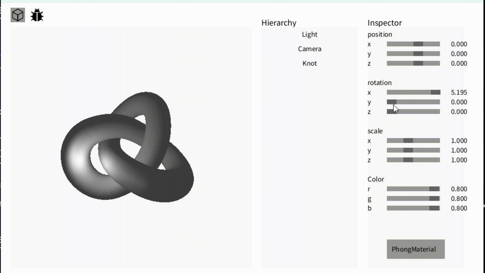
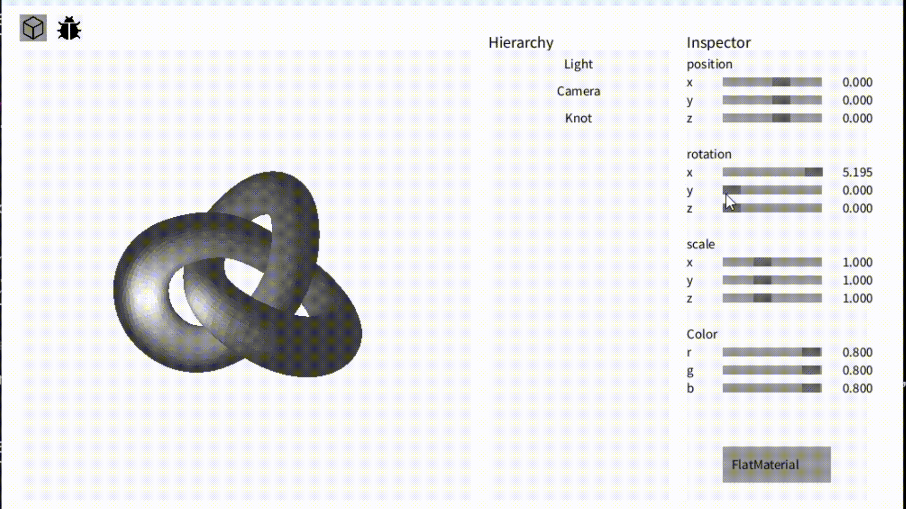
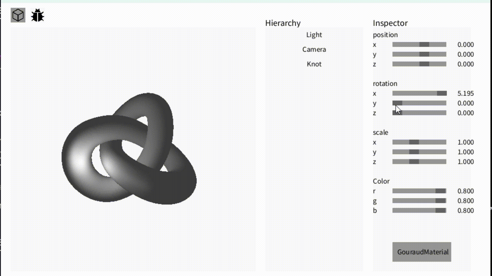

# Barycentric
For normal coordinate,
```math
\alpha = \frac{\text{Area}(\triangle PBC)}{\text{Area}(\triangle ABC)}
```
```math
\beta = \frac{\text{Area}(\triangle PCA)}{\text{Area}(\triangle ABC)}
```
```math
\gamma = 1 - \alpha - \beta
```
and then we have to calculate perspective situation.
Intermediate Step for Depth Correction
```math
Z_t = \frac{1}{\frac{\alpha}{w_A} + \frac{\beta}{w_B} + \frac{\gamma}{w_C}}
```
where $w_A,w_B,$ and $w_C$ are the $w$-components of vertices $A$, $B$, and $C$ in homogeneous coordinates.


After that we scale the barycentric weights $\alpha$, $\beta$, $\gamma$ as follows:
   ```math
   \alpha' = \alpha \cdot \frac{w_A}{Z_t}
   ```
   ```math
   \beta' = \beta \cdot \frac{w_B}{Z_t}
   ```
   ```math
   \gamma' = \gamma \cdot \frac{w_C}{Z_t}
   ```

# Phong Shading

In vertex shader only pass the coordinates and normal, and after the interpolation, the lighting is calculated for each fregment(pixel) based on interpolated coordinates and normals.

PhongVertexShader:
```processing
Vector4[][] result = { gl_Position, w_position, w_normal };
return result;
```

PhongFragmentShader:
```processing
Vector4 I = lighting(w_position, w_normal, albedo, kdksm);
illumination = (Vector3) I.xyz() ;
return new Vector4(illumination, 1.0);
```

# Flat Shading

In vertex shader making three vertex umiform color (based on the center of gravity and surface normal), doing this the interpolation is useless, all pixels belonging to same face will get same color.

FlatVertexShader:
```processing
Vector3 position = interpolation(abg, w_position).xyz(); // here abg is 1/3, 1/3, 1/3
Vector3 w_normal = Vector3.cross(Vector3.sub(w_position[1].xyz(), w_position[0].xyz()), Vector3.sub(w_position[2].xyz(), w_position[0].xyz())).unit_vector();
Vector4 I = lighting(position, w_normal, albedo, kdksm);
illumination[0] = I; illumination[1] = I; illumination[2] = I;
Vector4[][] result = {gl_Position, illumination};
return result;
```

FlatFragmentShader:
```processing
Vector3 illumination = (Vector3)varying[1];
return new Vector4(illumination,1.0);
```


# Gouraud Shading

Similar to flatshading, calculates color in vertex shader. But note that three vertex have their own color, and pass through the interpolation process. The fregment shader will receive the interpolated color for each pixel.

GouraudVertexShader:
```processing
Vector4 I0 = lighting(w_position[0].xyz(), w_normal[0].xyz(), albedo, kdksm);
illumination[0] = I0; 
Vector4 I1 = lighting(w_position[1].xyz(), w_normal[1].xyz(), albedo, kdksm);
illumination[1] = I1; 
Vector4 I2 = lighting(w_position[2].xyz(), w_normal[2].xyz(), albedo, kdksm);
illumination[2] = I2;
Vector4[][] result = {gl_Position, illumination};
return result;
```

GouraudFragmentShader:
```processing
Vector3 illumination = (Vector3)varying[1];
return new Vector4(illumination,1.0);
```


# Others
### lighting function
```processing
public Vector4 lighting(Vector3 w_position, Vector3 w_normal, Vector3 albedo, Vector3 kdksm) {
      Vector3 lightVector = Vector3.sub(basic_light.transform.position, w_position);
      Vector3 viewVector = Vector3.sub(lookat, main_camera.transform.position);
      float normalDot = Vector3.dot(w_normal, lightVector);
      // ambient light
      Vector3 I = Vector3.mult(Vector3.mult(1.0f, AMBIENT_LIGHT), albedo);      
      
      if (normalDot > 0) {
          float d = lightVector.length();
          float fatt = 1 / (0.1f + 0.1f * d + 0.1f * d * d);
          Vector3 diffuseLight = Vector3.mult(basic_light.light_color, new Vector3((normalDot < 0) ? 0 : normalDot));
          diffuseLight = Vector3.mult(albedo, Vector3.mult(kdksm.x * fatt, diffuseLight)); // Kd
          I = Vector3.add(I, diffuseLight);
          
          //Vector3 reflectVector = Vector3.mult(2 * normalDot, w_normal);
          Vector3 halfVector = Vector3.add(lightVector, viewVector).unit_vector();
          Vector3 specularLight = Vector3.mult(Math.max(0.0f, pow(Vector3.dot(halfVector, w_normal), kdksm.z)), basic_light.light_color);//(H·N)^m and if less than 0 then 0.
          specularLight = Vector3.mult(kdksm.y * fatt, specularLight);    // Ks
          I = Vector3.add(I, specularLight);  
      }
      
      // limit I value
      if (I.x > 1) I.x = 1;
      if (I.y > 1) I.y = 1;
      if (I.z > 1) I.z = 1;
      
      return new Vector4(I, 1.0);
}
```


